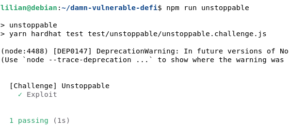

# Level 1 : Unstoppable

There's a lending pool with a million DVT tokens in balance, offering flash loans for free.

If only there was a way to attack and stop the pool from offering flash loans ...

You start with 100 DVT tokens in balance.

⇒ **The Idea here is to make the contract stopped, like a DOS, preventing anyon to interact with it.**

**For contracts :** 

- ERC20 contract for DVT (Damn Vulnerable Token) is OK, plus constructor verify that it is not an empty address
- Inherit ReentrancyGuard contract, so reentrancy won’t be the solution
- Solidity > 0.8 ⇒ Not vulnerable to underflow/overflow

**This kind of contract seems to be secure, let’s dive on the functions :** 

- FlashLoan :
    - require borrow > 0  which seems logic
    - line 36 et 37 are just checks for the pool
    - line 40 is interesting : `assert(poolBalance == balanceBefore);`
        - here is the only strict assertion and one of these parameters can be influenced by us : the balanceBefore.
        - If we send at least 1 token to the pool , the assertion is not true and the revert will occurs.

Regarding SWC it reminds me this vulnerability : [https://swcregistry.io/docs/SWC-132](https://swcregistry.io/docs/SWC-132)

Using the unstoppable.challenge.js we just have to add this line :

`await this.token.connect(attacker).transfer(this.pool.address,1);`

Then run the command to test 

### Key Security Takeaways

- Use assert statements only for static validations that normally never fail in a properly functioning code.
- Replace strict equality “==” with “>=” or “<=”